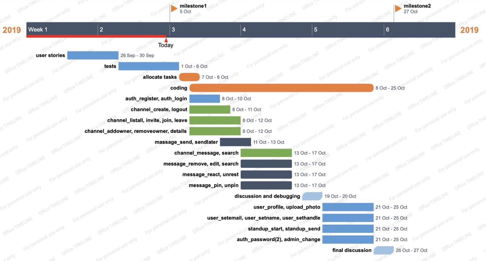

Approximately, iteration2 spans over 12 days. The group decided to separate the project to 3 steps.

In step one, four group members will start at the same time working on the 'root' functions. Since almost all the functions only work after the completion of ‘register’ and ‘login’, and functions related to channel only work after the completion of  ‘channel_create’,  they have to be done in the first two days. As we have two pairs of two, one pair will be working on 'login' and 'register', the other will be working on 'channel_crate'. We plan to finish them two days after specification gets released, including debugging and testing. Members who finish early can move on to constructing ‘message_send’ to ensure the progress of status.

In step two, the rest of the functions will be assigned to members and members will be asked to complete them on time. The diagram below provides a brief outlook. As seeing in the diagram, this project timeline is detailed over a span of 12 days, divided into tasks to be completed before each milestone, given an appropriate set period of time for completion. Due to the fact that members tend to be familiar with the functions that they wrote tests for, they will then be assigned to actually construct those functions, which can help to reduce the time waste on people understanding the functions that they are not familiar with.  
In this iteration, working collaboratively is an essential aspect since the functions members are about to write are heavily dependent. Additionally, at this step the work may not be evenly distributed since the member who writes massage_send will do extra work due to the project manner. Members who are able to finish their tasks before each due date are highly encouraged to assist others since people are working as a team. 
The weekend before step3, a meeting will be held to ensure every member has their tasks up-to-date before we move on to step3.

In step three, all the functions will be officially done and integrated. 
The final meeting will be held on the last weekend before due date. In this meeting, tests will be ran on each function individually and collectively, as to ensure the functions will work as a whole. 

HIGHLIGHT: Timeline is based on the logical implementing sequence and complexity of functions. As the  ‘auth_register’ and ‘auth_login’ are needed for all the other functions, ‘channel_create’ is needed for all channel and message functions, ‘message_send’ is required for all functions related to message, they should be considered as priorities.

Timeline diagram:

Massager app will be used to assist communication and "Office Timeline Online" will be used for making and adjusting timeline while doing the iteration2.
